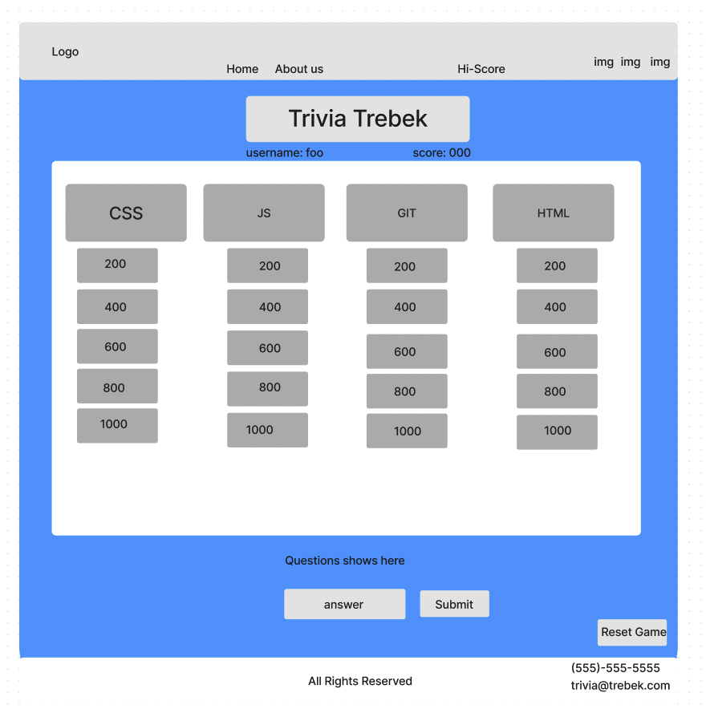
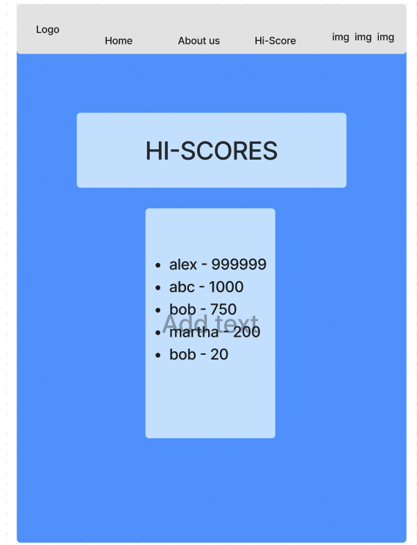
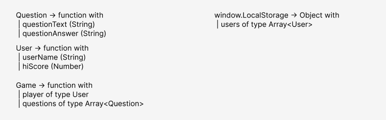

# trivia-trebek

## Project Description

- The Codefellows studying experience of a lifetime!
- Test your knowledge of webdev concepts with Jeopardy style gameshow!
- Question presentation!
- Interactive answering areas!
- Question catagories and value selector!
- Countdown timer?
- Score saving page!
- About us page!

  

  

  

## Domain Model

  

## Contributors

- Ben Lieberman
- Joe Rutkin
- Megan Seibert-Hughes
- Diego Sousa
- Marc Wagner
